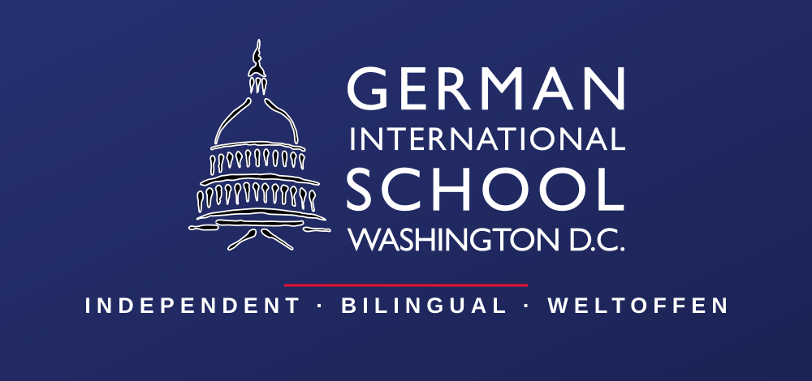

# German International School Washington D.C.

**Bilingual education, rooted in German values, at home in Washington.**

---

## 🌍 Who We Are

The **German International School Washington D.C. (GISW)** is a private, co-educational
institution with **more than 500 students** from **preschool through 12th grade**, set on a
quiet campus in **Potomac, Maryland**.

Representing **more than 20 different nationalities**, our student body is truly international —
united by a shared interest in German language and culture. As the **only full-time German day
school in Washington**, we offer rigorous academics in a warm, multicultural setting where
bilingualism is at the heart of everything we do.

> *"Our teachers prize critical inquiry — teaching students how, not what, to think."*

---

## 📊 At a Glance

| | |
|---|---|
| 🏫 **Founded** | September 11, 1961 — opened with 33 students |
| 👩‍🎓 **Enrollment** | 500+ students, PreK through Grade 12 |
| 🌐 **Community** | 20+ nationalities |
| 📍 **Campus** | 8617 Chateau Drive, Potomac, MD 20854 |
| 🎓 **Diplomas** | German International Abitur (DIA) + Maryland High School Diploma |
| ✅ **Accreditation** | Accredited by the German Ministry of Education · Approved by the Maryland State Department of Education |
| 🔬 **Distinction** | The first **MINT-EC** (STEM-excellence) school in the United States |
| 🤝 **Network** | Part of a global network of 140+ German Schools Abroad |
| 💛 **Status** | A recognized **Excellent German School Abroad** · 501(c)(3) non-profit |

---

## 🎯 Our Academic Focus

We concentrate on two areas of excellence:

### 🗣️ World Languages
Students who begin a bilingual education in preschool and continue through high school gain the
greatest benefits. Every GISW graduate achieves fluency in **at least two languages**, opening
doors across countries and continents.

### 🔬 Science
With a strong STEM identity as the first MINT-EC school in the U.S., students achieve mastery of
**biology, chemistry, and physics** — supported by faculty who are experts in their fields, the
majority holding advanced degrees (M.A., M.S., or the European equivalent).

---

## 💡 Why GISW

- **🌱 A true bilingual pathway** — from preschool through the Abitur, German and English grow together.
- **🎓 Choice at graduation** — the German International Abitur opens German universities for most
  fields of study, while our graduates are regularly admitted to selective colleges and universities
  across the U.S., Canada, and Europe.
- **🌏 A global community** — connected to 140+ German Schools Abroad, GISW families and alumni
  form friendships that last a lifetime, across borders.
- **👩‍🏫 Expert faculty** — highly trained teachers who bring rigor, warmth, and modern pedagogy
  to every classroom.

---

## 🧭 Our Mission

> We celebrate the growing international character and diversity of our student body, our
> bilingualism, and the tolerance and openness of our school community — while maintaining an
> **excellent, modern, and progressive German School Abroad.**

GISW began in 1961 as the *Deutsche Schule Washington D.C.* to serve the children of diplomats in
the nation's capital. More than six decades later, we have grown into a vibrant international
school that carries that heritage forward for families from around the world.

---

## 📬 Connect With Us

| | |
|---|---|
| 🌐 **Web** | [giswashington.org](https://giswashington.org) |
| 📘 **Facebook** | [@GISWashington](https://www.facebook.com/GISWashington/) |
| ✖️ **X / Twitter** | [@GIS_Washington](https://x.com/gis_washington) |
| 💼 **LinkedIn** | [German International School Washington D.C.](https://www.linkedin.com/school/deutsche-schule-german-school-washington-d-c-/) |
| 📞 **Phone** | (301) 767-3807 |
| 📍 **Visit** | 8617 Chateau Drive, Potomac, MD 20854 |

---

**🇩🇪 + 🇺🇸 — Two languages. Two cultures. One world-class education.**

This page is the public profile of the German International School Washington D.C. (GISW) organization on GitHub.

